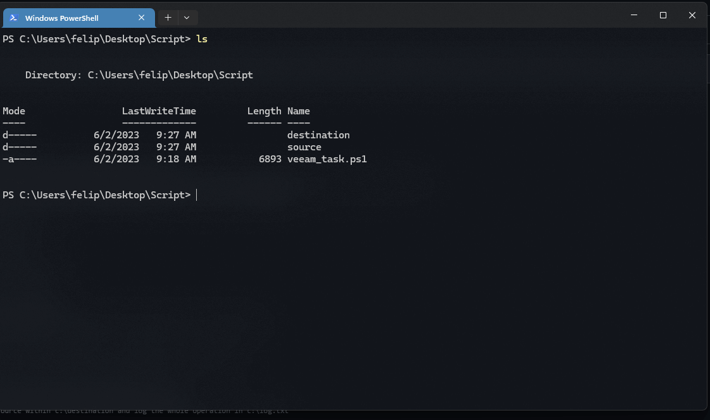

# veeam_PowershellDeveloper_Test
QA Integration Team test

## Challenge
- Implement a script that synchronizes two folders: source and replica. 
- The script should maintain a full, identical copy of source folder at replica folder. 
- The task should be done only using native PowerShell cmdlets.

## My Solution Syntax
Sync-Directory [-Source] <String> [-Destination] <String> [[-LogFilePath] <String>] [-Force] [-WhatIf] [-Confirm] [CommonParameters]

## My Solution Example
Sync-Directory -Source c:\source -Destination c:\destination -LogFilePath c:\log.txt

## Limitations
- Subfolders won't be deleted from destination folders, only its contents.
- `Source` and `Destination` parameters won't work with `relative paths`.

## Demo
